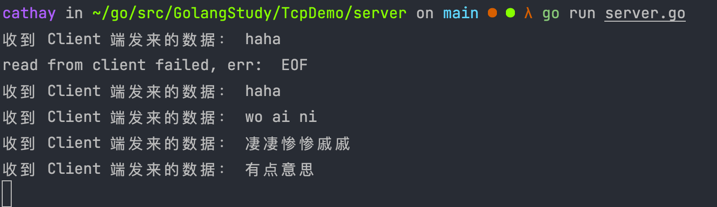

# TCP DEMO

## 如何运行：

- 终端 1 执行
    ```shell
    cd {projectName}/server
    go run server.go
    ```

- 终端 2 执行
  ```shell
  cd {projectName}/client
  go run client.go
  ```
  
## 结果示例：
- 服务端


- 客户端


> 原文链接：[TCP编程 · Go语言中文文档](https://topgoer.com/%E7%BD%91%E7%BB%9C%E7%BC%96%E7%A8%8B/socket%E7%BC%96%E7%A8%8B/TCP%E7%BC%96%E7%A8%8B.html)